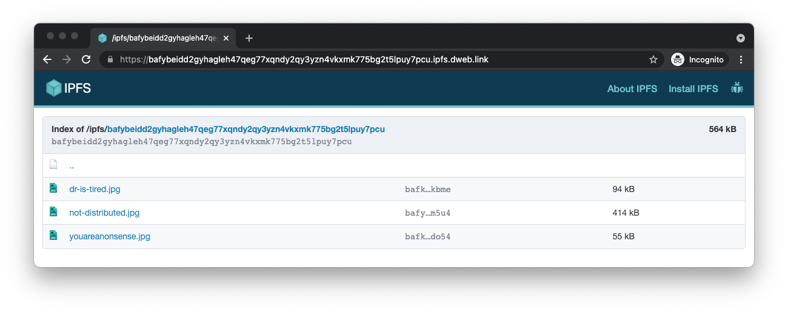

# Retrieve

All data stored using Web3.Storage is made available for retrieval via [IPFS](https://ipfs.io), the InterPlanetary File System. IPFS is a distributed, peer-to-peer network for storing and sharing [content addressed data][concepts-content-addressing].

This guide will show several ways to retrieve your data from IPFS, either using [the Web3.Storage client](#using-the-web3-storage-client), via an [HTTP gateway](#using-an-ipfs-http-gateway), or with [the IPFS command line tools](#using-the-ipfs-command-line).

## Using the Web3.Storage client

The Web3.Storage JavaScript client provides a `get` method that allows you to retrieve any IPFS content using its [Content Identifier (CID)][ipfs-docs-cid].

First, you'll need to create a Web3.Storage client using an API token. See the [Quickstart page][quickstart-guide] if you don't yet have an API token.

```js
import { Web3Storage } from 'web3.storage'
const token = process.env.WEB3_STORAGE_TOKEN
const client = new Web3Storage({ token })
```

Once you have a client, you can call `client.get`, passing in a CID string:

```js
const cid = 'bafybeidd2gyhagleh47qeg77xqndy2qy3yzn4vkxmk775bg2t5lpuy7pcu'
try {
  const res = await client.get(cid)
} catch (err) {
  console.error(`failed to get ${cid}: `, err)
}
```

### The `Web3Response` object

The `get` method returns a `Web3Response` object that extends the [`Response` object][mdn-response] from the Web [Fetch API][mdn-fetch] with two methods that provide access to the retrieved IPFS data.

#### `files`

The [`files` method][reference-js-web3response-files] returns an array of `Web3File` objects representing all files contained in the content archive identified by the given CID. A `Web3File` is just like a regular Web [`File` object][mdn-file], with the addition of `path` and `cid` properties containing the relative path of the file within the archive, and the CID of the file, respectively.

```js
const res = await client.get(cid)
const files = await res.files()
for (const file of files) {
  console.log(`${file.cid} -- ${file.path} -- ${file.size}`)
}
```

:::tip Using unixFs objects
Another option is to use the array of `unixFs` objects provided by the `unixFsIterator()` method to iterate through the files. While in the vast majority of cases you will want to use the `files()` method outlined above, existing IPFS users may prefer interacting with `unixFs` objects if they have existing code or tooling that supports it. For more details, see the [Client Library reference](/reference/client-library.md).
:::

## Using an IPFS HTTP gateway

You can easily fetch any data stored using Web3.Storage using an HTTP gateway. Because IPFS is a peer-to-peer, decentralized network, you can use any public gateway to fetch your data. In this guide, we'll use the gateway at `dweb.link`, but you can check the [list of public gateways](https://ipfs.github.io/public-gateway-checker/) to find the best one for your needs.

When you [store data using the Web3.Storage client][howto-store], the `put` method returns an [IPFS content identifier (CID)][ipfs-docs-cid] string. That CID points to an IPFS directory that contains all the files passed in to the `put` method.

You can view a listing of all the files in the directory using an IPFS gateway by creating a gateway URL. For example, if your CID is `bafybeidd2gyhagleh47qeg77xqndy2qy3yzn4vkxmk775bg2t5lpuy7pcu`, you can make a URL for the gateway at `dweb.link`: [bafybeidd2gyhagleh47qeg77xqndy2qy3yzn4vkxmk775bg2t5lpuy7pcu.ipfs.dweb.link](https://bafybeidd2gyhagleh47qeg77xqndy2qy3yzn4vkxmk775bg2t5lpuy7pcu.ipfs.dweb.link/).

If you follow the link, you should see a page similar to this:



To link directly to a file within the bundle, just add the file path after the CID portion of the link. For example: [bafybeidd2gyhagleh47qeg77xqndy2qy3yzn4vkxmk775bg2t5lpuy7pcu.ipfs.dweb.link/not-distributed.jpg](https://bafybeidd2gyhagleh47qeg77xqndy2qy3yzn4vkxmk775bg2t5lpuy7pcu.ipfs.dweb.link/not-distributed.jpg)

## Using the IPFS command line

If you have the [IPFS command line interface][ipfs-docs-cli-quickstart] installed, you can use it directly to fetch data without going through a gateway:

To get the whole bundle and save it to a directory, run:

```shell
ipfs get bafybeidd2gyhagleh47qeg77xqndy2qy3yzn4vkxmk775bg2t5lpuy7pcu
```

If you want to get a specific file out of the bundle, add the filename onto the end of the `ipfs get bafybie...` command:

```shell
ipfs get bafybeidd2gyhagleh47qeg77xqndy2qy3yzn4vkxmk775bg2t5lpuy7pcu/youareanonsense.jpg
```

<!-- internal links -->
[quickstart-guide]: ../quickstart/README.md
[concepts-content-addressing]: ../concepts/content-addressing.md
[howto-store]: ./store.md

[reference-js-web3response-files]: ./FIXME.md
[reference-js-web3response-unixfsiterator]: ./FIXME.md

<!-- external links -->
[ipfs-docs-cid]: https://docs.ipfs.io/concepts/content-addressing/
[ipfs-docs-cli-quickstart]: https://docs.ipfs.io/how-to/command-line-quick-start/

[mdn-fetch]: https://developer.mozilla.org/en-US/docs/Web/API/Fetch_API
[mdn-file]: https://developer.mozilla.org/en-US/docs/Web/API/File
[mdn-response]: https://developer.mozilla.org/en-US/docs/Web/API/Response
